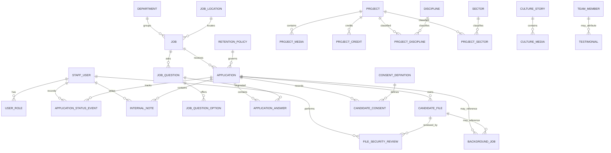

# Phase 0E: Production Data Model

**Status:** Accepted for Phase 0E documentation; implementation remains gated

**Date:** 2026-08-27

**Scope:** Conceptual PostgreSQL model compatible with a later Prisma implementation. No schema, migration, provider resource, credential, package, or application code is created by this record.

## 1. Principles

- PostgreSQL is the system of record; Google Drive stores candidate-file bytes only (FR-009, SEC-002, PRIV-005).
- Candidate files, contact data, answers, notes, consent, retention, and authorization stay in explicit relational records. JSON is limited to constrained rich-text documents and small non-sensitive operational metadata.
- Authentication remains in Supabase Auth. The application stores only the external Supabase subject and local staff authorization data (FR-012, SEC-001, SEC-005).
- Candidates have no accounts and are not silently matched or merged (FR-019, PRIV-001).
- Technical submission state, file validation/security state, hiring state, publication state, and retention/deletion state are independent.
- Candidate access fails closed. A valid PDF is still untrusted until an authorised manual or future automated security review records clearance (SEC-002, SEC-003).
- Foreign keys, check constraints, unique constraints, transactions, and immutable event rows protect integrity before application convenience.
- UTC timestamps are persisted; presentation time zones are applied later. Public references and storage names contain no personal data.
- Deletion and retention are policy-driven. Exact periods and legal treatment remain owner/legal decisions and are not hard-coded (PRIV-002–PRIV-004, OPS-002).
- The model is intentionally a bounded website administration model, not an open-ended CMS, CRM, or ATS (FR-019).

## 2. Entity overview

| Domain | Entities | Decision |
| --- | --- | --- |
| Staff identity | `StaffUser`, `UserRole` | Supabase owns credentials and MFA. Fixed application role codes avoid a dynamic permission-builder in MVP. |
| Portfolio | `Project`, `ProjectMedia`, `ProjectCredit`, `Discipline`, `Sector`, join tables | Explicit case-study fields and ordered media; no binaries in PostgreSQL. |
| Culture | `CultureStory`, `CultureMedia`, `TeamMember`, `Testimonial`, `Department` | Explicit first-release structures; timeline entries are culture stories with a date/kind. |
| Site configuration | `SiteConfiguration`, `SocialLink` | Typed singleton plus ordered links; no generic key/value dumping ground and no secrets. |
| Jobs | `Job`, `JobQuestion`, `JobQuestionOption`, `JobLocation` | One location per MVP job; immutable question rows once answered. |
| Applications | `Application`, `ApplicationAnswer`, `CandidateFile`, `FileSecurityReview`, `CandidateConsent`, `ApplicationStatusEvent`, `InternalNote` | Application owns the candidate contact snapshot; no `Candidate` table. |
| Policy | `ConsentDefinition`, `RetentionPolicy` | Immutable version rows are referenced by historical evidence. |
| Operations | `AuditEvent`, `BackgroundJob`, `IdempotencyRecord`, `RateLimitBucket` | Append-only audit, durable jobs, scoped retry protection, and short-lived coarse abuse state. |

Not separate tables in MVP:

- `Candidate`: rejected; see section 5.
- `Role`/`Permission`: fixed role and permission codes are safer and smaller initially. `UserRole` records assignments and their audit provenance.
- `CultureTimelineEvent`: represented by `CultureStory.kind = EVENT` plus `occurredOn`.
- `Redirect`: published slugs are immutable in MVP, so redirect history is deferred.
- `LegalHold`: no approved requirement yet. Add only after legal policy defines authority, scope, expiry, and audit behaviour.
- Arbitrary feature flags: deployment configuration owns technical flags; only approved editorial/recruitment settings belong in `SiteConfiguration`.

## 3. ER diagram

## 4. Entity definitions

All IDs below are opaque UUIDs unless noted. Required text fields use explicit length limits and reject control characters. Free text is never copied into logs, audit metadata, email payloads, URLs, or public references.

### Identity and authorization

| Entity | Important fields and constraints |
| --- | --- |
| `StaffUser` | `id`, unique `supabaseUserId`, `displayName`, `status` (`ACTIVE`, `DISABLED`), `createdAt`, `disabledAt`. No password, MFA secret, refresh token, or session data. `disabledAt` is required exactly when disabled. |
| `UserRole` | `id`, `staffUserId`, `roleCode`, `grantedByStaffUserId`, `grantedAt`, nullable `revokedAt`. Only one active assignment per user/role. Disabled users have no effective permissions even if assignments remain for history. |

### Shared business vocabulary

| Entity | Important fields and constraints |
| --- | --- |
| `Department` | `id`, unique `code`, unique `slug`, `name`, optional approved `publicDescription`, `active`, `sortOrder`. Shared by jobs, talent submissions, and culture collaboration copy. |
| `Discipline` | `id`, unique `slug`, `name`, `active`, `sortOrder`. Portfolio classification, distinct from employing department. |
| `Sector` | `id`, unique `slug`, `name`, `active`, `sortOrder`. Portfolio classification. |

### Applications and policy

| Entity | Important fields and constraints |
| --- | --- |
| `Application` | See sections 5 and 6. Owns contact snapshot, type, technical status, current hiring status, applied retention policy, expiry, and deletion timestamps. |
| `ApplicationAnswer` | `id`, `applicationId`, nullable `jobQuestionId`, `questionTextSnapshot`, `questionTypeSnapshot`, optional `answerText`, `answerBoolean`, `selectedOptionLabelSnapshot`, `createdAt`. Exactly one answer value shape is allowed for the snapshot type. |
| `CandidateFile` | See section 8. One active PDF per application in MVP; replacement creates a new row and deletes/retires the old row through policy. |
| `FileSecurityReview` | Immutable review attempt: file, method, reviewer/system actor, tool description/version, file hash snapshot, outcome, safe summary, timestamps, and idempotency key. |
| `ConsentDefinition` | `id`, `consentType`, `version`, immutable approved text or content reference, `effectiveFrom`, `status` (`DRAFT`, `ACTIVE`, `RETIRED`). Unique `(consentType, version)`. |
| `CandidateConsent` | `id`, `applicationId`, `consentDefinitionId`, `decision` (`ACCEPTED`, `REJECTED`), `recordedAt`, `source` (`JOB_FORM`, `TALENT_FORM`), safe `requestId`. Unique `(applicationId, consentDefinitionId)`. |
| `RetentionPolicy` | `id`, `category`, `version`, `durationDays`, `effectiveFrom`, `status` (`DRAFT`, `ACTIVE`, `RETIRED`), `createdAt`. Rows are immutable after activation; exact durations remain unresolved. |
| `ApplicationStatusEvent` | Immutable `applicationId`, `fromStatus`, `toStatus`, `actorStaffUserId`, safe `reasonCode`, optional bounded non-sensitive `summary`, `occurredAt`. |
| `InternalNote` | `id`, `applicationId`, `authorStaffUserId`, bounded `body`, `createdAt`. Notes are append-only; corrections create a new note rather than rewriting history. |

### Operations

| Entity | Important fields and constraints |
| --- | --- |
| `AuditEvent` | See section 14. Append-only, PII-safe, and separate from candidate notes/history. |
| `BackgroundJob` | See section 15. Durable PostgreSQL queue row with bounded retry and lease fields. |
| `IdempotencyRecord` | `id`, `scope`, keyed hash of client key, request hash, state, nullable opaque result reference, `createdAt`, `expiresAt`; unique `(scope, keyHash)`. No request/response body. |
| `RateLimitBucket` | `scope`, keyed digest, `windowStartedAt`, `count`, `expiresAt`; unique `(scope, keyDigest, windowStartedAt)`. Raw IP addresses are not stored. |

## 5. Candidate/application model

### Decision: no reusable `Candidate` record in MVP

`Application` owns a contact snapshot. This is the smallest privacy-conscious model because:

- candidates have no account or authenticated identity (FR-019);
- email/phone equality is not reliable proof that two submissions are the same person;
- automatic merging increases accidental disclosure and complicates deletion/retention across unrelated applications;
- each job or talent submission has its own consent, purpose, retention policy, answers, and status history;
- duplicate prevention is a retry/idempotency concern, not identity matching.

Staff may see that records appear similar only if a separately approved workflow is later added. The system must not merge or link them automatically. A reusable candidate/person entity should be introduced only if a future approved requirement needs candidate-managed identity or an explicitly consented cross-application relationship.

## 6. Application types and fields

`ApplicationType`:

- `JOB_APPLICATION`: `jobId` is required and immutable after submission; the job may later close/archive but is not deleted.
- `TALENT_NETWORK`: `jobId` is null and `engagementType` is required.

`TalentEngagementType`: `PERMANENT_INTEREST`, `FREELANCE_PROJECT`, `INTERNSHIP_EARLY_CAREER`, `PORTFOLIO_INTRODUCTION` (FR-008).

| Field group | Required | Optional | Conditional/invariant |
| --- | --- | --- | --- |
| Identity/reference | `id`, unique non-enumerable `publicReference`, `applicationType` | — | Reference contains no PII and is never authorization. |
| Vacancy | — | `jobId` | Required only for `JOB_APPLICATION`; null for talent submissions. Job identity is immutable. |
| Contact | `fullName`, `email`, `city` | `phoneOrWhatsApp` | Nullable after completed deletion/anonymisation. No CNIC, passport, banking, family, or identity-document fields (PRIV-001). |
| Professional | `departmentId` or approved department selection, `experienceLevel` | `specialism`, `portfolioUrl`, `professionalUrl`, `availabilityText`, `remoteAvailable`, `shortIntroduction` | URLs must be HTTPS/HTTP and length-bounded. Portfolio-only submissions require at least one professional/portfolio URL. |
| Engagement | — | `engagementType`, `preferredEngagement`, `freelancerRateMinMinor`, `freelancerRateMaxMinor`, `rateCurrency` | Engagement required for talent network. Rate range allowed only for freelance/project interest; integer minor units, same currency, min <= max. |
| Accessibility | — | `accommodationRequest` | Collected only after approved HR/legal wording; access is limited to `application.accommodation.read`. It is not copied to general notes or analytics. |
| Source | `source` | safe campaign code | Fixed source codes only; no referrer URL containing personal/query data. |
| State | `technicalStatus`, `createdAt`, `updatedAt` | `hiringStatus`, `submittedAt`, `withdrawnAt` | Hiring status is null before technical submission and becomes `NEW` on `SUBMITTED`; later changes require immutable events. Technical and hiring states remain separate. |
| Retention/deletion | `retentionPolicyId`, `expiresAt` | `deletionRequestedAt`, `deletionCompletedAt` | Policy/version selected transactionally at submission. Required fields may become null only after completed anonymisation. |

No stored candidate draft is required for MVP. A short-lived server submission intent may exist in `IdempotencyRecord`; it is not a candidate account or resumable profile.

## 7. Job model

`Job` fields:

- immutable `id`; unique stable `slug`;
- `title`, `departmentId`, `jobLocationId`, `workArrangement`, `employmentType`, `experienceLevel`, `shiftSchedule`;
- optional compensation statement and optional numeric range (`minMinor`, `maxMinor`, ISO currency, period), published only when HR policy allows (CR-004);
- `summary`, `responsibilities`, `requiredQualifications`, `preferredQualifications`, `hiringProcessCopy`;
- `applicationDeadline`, optional `publishAt`;
- `lifecycleState`, `createdAt`, `updatedAt`, `publishedAt`, `closedAt`, `archivedAt`.

Narrative fields use either bounded plain text or one approved, constrained rich-text AST. Arbitrary HTML is prohibited (SEC-007). Numeric compensation fields are both null or both populated, use integer minor units, and require `min <= max`.

`JobLocation` stores an approved reusable label, city, optional address/public map URL, and active status. One location per job is sufficient for MVP; add a join table only when a real multi-location vacancy exists.

`JobQuestion` contains `jobId`, `questionType` (`SHORT_TEXT`, `LONG_TEXT`, `SELECT`, `YES_NO`), `prompt`, `required`, `sortOrder`, and `active`. `SELECT` options use ordered `JobQuestionOption` rows, not executable or arbitrary JSON schemas. Once any answer references a question, its prompt/type/options are immutable; editors create a replacement row. `ApplicationAnswer` also snapshots the prompt/type/selected label so historical answers remain interpretable if a job is archived (FR-014).

Job lifecycle rules are defined in [state-machines.md](state-machines.md). Application acceptance is always computed server-side as:

`state = PUBLISHED AND publishAt <= now AND (applicationDeadline IS NULL OR now < applicationDeadline) AND closedAt IS NULL`.

The request path enforces this predicate even if cron-driven closure is late. Expired jobs emit no `JobPosting` structured data and accept no new submissions (SEO-003).

## 8. Candidate file/security model

`CandidateFile` stores metadata only:

- `id`, `applicationId`;
- private `driveFileId` and optional controlled `driveZoneCode`; never a public URL;
- generated opaque `storedFilename` ending `.pdf`;
- no persisted original filename in MVP because it may contain PII and is not operationally required;
- `extension`, declared and detected MIME, `sizeBytes`, SHA-256 `contentHash`;
- `validationStatus`, `technicalStatus`, `securityStatus`;
- nullable `clearanceMethod`, `clearedAt`, `deletedAt`, `createdAt`, `updatedAt`;
- optimistic `version` for state-race protection.

The maximum is read from typed recruitment configuration, initially 5 MiB, and is enforced at every available boundary. PDF extension, MIME, and `%PDF-` signature checks are validation only; they never set clearance.

State dimensions:

| Dimension | Values | Purpose |
| --- | --- | --- |
| `validationStatus` | `PENDING`, `PASSED`, `FAILED` | File type/size/signature checks. A failed row can never be cleared; the candidate must submit a replacement file. |
| `technicalStatus` | `UPLOAD_PENDING`, `QUARANTINED`, `PROCESSING_FAILED`, `DELETED` | Drive/storage processing and irreversible domain deletion. |
| `securityStatus` | `UNREVIEWED`, `IN_REVIEW`, `CLEARED`, `REJECTED`, `REVIEW_FAILED` | Malware/security disposition. |
| `clearanceMethod` | null, `MANUAL`, `AUTOMATED` | How a `CLEARED` result was reached. Initial production uses `MANUAL`; a future scanner writes the same review model. |

`FileSecurityReview` is separate and immutable because a mutable row or generic audit event cannot faithfully represent multiple attempts. It records:

- `candidateFileId`, `method` (`MANUAL`, `AUTOMATED`), actor (`reviewerStaffUserId` or named system actor);
- `startedAt`, `completedAt`, `outcome` (`CLEARED`, `REJECTED`, `INDETERMINATE`, `FAILED`);
- bounded non-sensitive tool/product and version description;
- the file SHA-256 observed for the review;
- a safe outcome code/summary and scoped idempotency key.

The clear transition occurs in one database transaction that inserts the immutable review, checks the file hash/version and validation state, updates the current security projection, and appends an audit event. Uncleared files are never normally downloadable by hiring reviewers. Quarantine retrieval is attachment-only, freshly authorised, and limited to `candidate_file.security_review`; the Drive ID is never returned to the browser.

## 9. Consent

- A `ConsentDefinition` version is immutable after activation. Text may be stored directly if bounded or referenced by immutable content revision.
- A submitted application must record every required consent decision against an active version in the same transaction as submission (PRIV-002).
- A single mutable boolean is prohibited. New privacy wording creates a new version; historical decisions stay linked to the version shown.
- Request context is limited to safe source code and request ID. Raw IP, user agent, form body, and document metadata are not consent evidence by default.
- Required rejected consent prevents submission; optional consent may be stored as rejected when the approved form genuinely offers a choice.

## 10. Retention and deletion

`RetentionPolicy` is versioned by application category. Activation requires an approved duration; the application snapshots the selected policy row and calculated `expiresAt`. No duration is hard-coded in the conceptual schema (PRIV-004).

Legal hold is not modelled in MVP because authority and legal rules are unresolved. If legal review requires it, add an explicit hold record with reason code, approver, scope, start/end, and audit—not a casual boolean.

Conceptual deletion workflow:

1. Authorised request records `deletionRequestedAt`, an audit event, and a unique background job.
2. The job marks candidate access unavailable before destructive work.
3. Drive content is deleted and reconciled; retries remain fail closed.
4. Answers, contact fields, introductions, accommodation data, notes, original-provider IDs, and content hashes are erased or nullified.
5. The application becomes an anonymised tombstone with opaque ID/reference, type, policy/version, coarse timestamps, and `deletionCompletedAt` only if approved policy permits.
6. Consent evidence and audit events receive the treatment approved by legal policy. The schema can retain them linked to the anonymised application or cascade-delete consent; this is intentionally unresolved rather than asserted as law.
7. Short-lived idempotency/rate-limit/job data expires separately.

Candidate-file bytes are hard-deleted from Drive. PII and free-text business records are erased/anonymised. Minimal PII-free audit/security events may be retained under a separately approved audit-retention policy. Restored backups must remain isolated until deletion/retention state is replayed; backup implementation and testing are later-phase work (OPS-002, OPS-006).

## 11. Public content

### Portfolio

`Project` includes stable slug, title, approved client/anonymised descriptor, year, summary/brief, challenge, approach, outcome, featured flag, publication fields, timestamps, and optimistic version. Claims remain approval-bound (BR-001, CR-001, CR-008).

`ProjectMedia` includes project, media type (`IMAGE`, `VIDEO`, `POSTER`, `MODEL_3D`), private/admin source reference and public delivery path, poster reference where needed, width, height, aspect ratio, duration, alt text, caption, transcript/accessibility description, sort order, and timestamps. No binary is stored in PostgreSQL.

`ProjectCredit` stores approved display name/organisation, role, sort order, and optional approved URL. It must not create a staff identity relationship merely because a credited person is also staff.

Explicit `ProjectDiscipline` and `ProjectSector` joins provide stable filtering and referential integrity (FR-002).

### Culture

`CultureStory` has a constrained kind (`MANIFESTO`, `PRINCIPLE`, `EVENT`, `WORKSPACE`, `RECOGNITION`, `GROWTH`, `COLLABORATION`), title, approved body, optional event date, optional department, sort order, and publication fields. This covers first-release timeline/event entries without another table.

`CultureMedia` provides the same ordered public-media/accessibility metadata needed for a story, but remains separate from project media to avoid a polymorphic owner column.

`TeamMember` stores only approved public display name, role title, optional department, biography, media reference, consent/approval reference, sort order, and publication fields. It is not a staff account.

`Testimonial` stores approved quote, attribution snapshots, optional `teamMemberId`, consent/approval reference, sort order, and publication fields. Attribution snapshots remain truthful if a team record is later archived.

### Publication

Public content uses a common `PublicationState` (`DRAFT`, `SCHEDULED`, `PUBLISHED`, `ARCHIVED`) only where behaviour is genuinely shared. Public visibility requires state/time checks; scheduled content is not visible early. Jobs retain their own lifecycle because `CLOSED` and application acceptance have different rules.

Selected narrative fields may use a versioned constrained rich-text JSON AST because headings, paragraphs, lists, and links require structured flexibility. The allowed node set, maximum depth/size, link protocols, validation, and renderer must be fixed before implementation. Core identifiers, states, relations, money, dates, ordering, approvals, and policies remain columns.

## 12. Slugs and site configuration

- Slugs are lower-case ASCII, human-readable, safely normalised, unique within their content type, and checked against reserved routes.
- Published slugs are immutable in MVP. This avoids a `Redirect` table while preventing broken indexed URLs (SEO-001).
- If the owner later requires changing a published slug, add an explicit old-path to canonical-path redirect record before allowing the change.

`SiteConfiguration` is a singleton typed record for approved parent-company wording, public contact details, approved office/location copy, candidate support contact, `maxCandidateFileBytes`, recruitment intake enabled state, and operationally justified public settings. `SocialLink` holds typed platform, approved URL, label, sort order, and active state.

Secrets, Drive IDs, OAuth credentials, SMTP credentials, Turnstile secrets, database URLs, internal recipient lists, and sensitive operational policy never belong in site settings. Technical feature flags stay in deployment configuration unless an approved editorial need requires otherwise.

## 13. Staff identity

Supabase Auth owns authentication, credentials, TOTP factors, recovery, sessions, and revocation. `StaffUser.supabaseUserId` maps an authenticated subject to the local profile. There is no local password, MFA secret, or copied auth metadata.

Every private operation requires:

1. a valid Supabase session with required MFA assurance;
2. an existing local `StaffUser` in `ACTIVE` state;
3. an active `UserRole` assignment granting the domain operation;
4. target, row state, retention, and scope checks.

Disabling a staff profile immediately makes all application permissions ineffective, regardless of an otherwise valid Supabase session. The operation also triggers Supabase session revocation as a side effect, but revocation success is not trusted as the sole deny control.

## 14. Audit model

`AuditEvent` is append-only and contains:

- `id`, `occurredAt`;
- `actorType` (`STAFF`, `SYSTEM`, `ANONYMOUS`), nullable `actorStaffUserId`;
- fixed `actionCode`, `targetType`, opaque `targetId`;
- `outcome` (`SUCCEEDED`, `DENIED`, `FAILED`), safe `reasonCode`;
- request/correlation ID and optional small allowlisted JSON metadata.

It never stores names, emails, phone numbers, free text, note bodies, answers, filenames, file contents, Drive IDs/URLs, access tokens, credentials, raw IPs, or stack traces (SEC-006, SEC-008). Candidate/file view attempts, quarantine retrieval, clearance results, cleared download, hiring transitions, notes, deletion, retention-policy changes, publication, role assignment, and staff disablement are audited.

Append-only is enforced through application permissions and a database role that cannot update/delete audit rows. Stronger tamper evidence or external export is deferred until an approved operations requirement justifies it.

## 15. Background jobs

`BackgroundJob` fields:

- `id`, `jobType`;
- nullable explicit `applicationId` and `candidateFileId` foreign keys; at most one subject unless the job is a sweep;
- optional small allowlisted JSON payload containing only non-sensitive operational options;
- `state` (`QUEUED`, `RUNNING`, `SUCCEEDED`, `DEAD`);
- `attemptCount`, `maxAttempts`, `availableAt`;
- nullable `claimedAt`, `claimExpiresAt`, random `claimToken`;
- nullable `completedAt`, `failureClass`, bounded scrubbed `errorSummary`;
- unique optional `dedupeKey`, `createdAt`, `updatedAt`.

One protected Hostinger cron invocation claims a bounded batch in a short PostgreSQL transaction using `FOR UPDATE SKIP LOCKED` or an equivalent atomic update. Claim increments attempts and sets a lease. External work occurs after commit. Success/failure is written only by the matching claim token. Expired leases can be reclaimed; retry scheduling is bounded; exhausted jobs become `DEAD` and alert an owner. Handlers remain idempotent and PostgreSQL business rows, not the queue, are authoritative (OPS-004).

Initial job types: receipt email, retention/deletion, stale-submission cleanup, and Drive reconciliation. No candidate PII or email body is stored in the job payload.

## 16. Rate limiting and idempotency

A minimal persistent `RateLimitBucket` is justified for coarse submission/upload controls because in-process memory is not authoritative across restarts or multiple processes (SEC-004). Turnstile and Hostinger protections remain additional layers.

- Key digests use a secret-keyed hash of the approved abuse key (for example normalised IP plus route scope); raw IPs are not retained.
- Buckets have short expiry and are deleted automatically. They are not analytics or a permanent block list.
- Shared/mobile networks receive challenge/backoff behaviour rather than indefinite denial.

Authoritative idempotency:

| Operation | Control |
| --- | --- |
| Application submission | Unique `(scope, keyHash)` `IdempotencyRecord`, request hash comparison, and one transaction creating application/reference/consent. Same key + different request is rejected. |
| File completion | Unique Drive file ID, unique active file per application, content hash/version check, and scoped idempotency key. |
| Manual security result | Unique review idempotency key plus candidate-file optimistic version/hash checked in the clearance transaction. |
| Background work | Unique/deduplicated job intent where needed plus idempotent handler state checks. |

Idempotency records keep only hashes and opaque result references and expire after the operational retry window defined before implementation.

## 17. Indexing

Create only workload-critical indexes initially:

- unique public slugs per content type; unique application public reference;
- `Job(lifecycleState, publishAt, applicationDeadline)` and `Job(departmentId, lifecycleState)`;
- `Project(publicationState, featured, publishedAt)`;
- join-table composite primary/unique keys for project discipline/sector;
- `Application(jobId, hiringStatus, createdAt)`, `Application(applicationType, hiringStatus, createdAt)`, and `Application(expiresAt)`;
- `CandidateFile(securityStatus, createdAt)` and unique private `driveFileId` while present;
- `BackgroundJob(state, availableAt)` plus `claimExpiresAt` for recovery;
- `AuditEvent(targetType, targetId, occurredAt)` and `AuditEvent(actorStaffUserId, occurredAt)`;
- unique idempotency scope/key and rate-limit scope/digest/window.

Do not index names, emails, phone numbers, free text, note bodies, answers, or every enum without measured need.

## 18. Referential integrity

| Relationship | Behaviour | Reason |
| --- | --- | --- |
| `Job -> Application` | `RESTRICT` job deletion; archive instead | Historical applications remain tied to the immutable vacancy (FR-006). |
| `Application -> Answer/Consent/StatusEvent/Note` | Application-controlled deletion; normally `CASCADE` only inside the authorised deletion transaction | Prevent partial orphaned candidate data. |
| `Application -> CandidateFile` | Application-controlled workflow, not blind cascade | Drive deletion/reconciliation must complete or remain fail closed before metadata removal. |
| `CandidateFile -> FileSecurityReview` | `RESTRICT` ordinary deletion; controlled tombstone/anonymisation | Preserve review integrity until approved retention deletion. |
| `StaffUser -> AuditEvent/StatusEvent/Note/Review` | `RESTRICT`/retain reference; disable staff rather than delete | Historical actions must retain actor identity internally. |
| `JobQuestion -> ApplicationAnswer` | `SET NULL` only in controlled exceptional deletion; snapshots remain | Answers remain interpretable. Normal question deletion is restricted after use. |
| `Project -> Media/Credit/joins` | `CASCADE` only for never-published drafts; archive published projects | Avoid orphaned public content and broken history. |
| Vocabulary rows in use | `RESTRICT`; mark inactive | Historical filters and records remain valid. |

Primary IDs and external identity IDs are never updated. Slugs follow section 12. Deletion that touches Drive is coordinated by application transaction/state and background reconciliation, not a database cascade pretending an external side effect succeeded.

## 19. Identifiers and time

- Persist timezone-aware UTC timestamps (`timestamptz`). Scheduling input must be converted with an explicit editor time zone; Hostinger cron is UTC.
- Prefer UUIDv7 for internal primary IDs if the selected PostgreSQL/Prisma versions support a reviewed generator; otherwise use application-generated UUIDv4. Do not add CUID2 solely for novelty.
- Public application references are separate random values, approximately 10–14 Crockford Base32 characters with enough entropy, grouped for correspondence, unique, non-sequential, and free of personal data.
- Public references are lookup aids only. They never authorize application or file access.

## 20. Prisma mapping preparation

Conceptual Prisma models:

`StaffUser`, `UserRole`, `Department`, `Discipline`, `Sector`, `Project`, `ProjectMedia`, `ProjectCredit`, `ProjectDiscipline`, `ProjectSector`, `CultureStory`, `CultureMedia`, `TeamMember`, `Testimonial`, `SiteConfiguration`, `SocialLink`, `JobLocation`, `Job`, `JobQuestion`, `JobQuestionOption`, `Application`, `ApplicationAnswer`, `CandidateFile`, `FileSecurityReview`, `ConsentDefinition`, `CandidateConsent`, `RetentionPolicy`, `ApplicationStatusEvent`, `InternalNote`, `AuditEvent`, `BackgroundJob`, `IdempotencyRecord`, `RateLimitBucket`.

Conceptual enums:

`StaffStatus`, `StaffRole`, `PublicationState`, `JobLifecycleState`, `ApplicationType`, `TalentEngagementType`, `ApplicationTechnicalStatus`, `HiringStatus`, `QuestionType`, `FileValidationStatus`, `FileTechnicalStatus`, `FileSecurityStatus`, `SecurityReviewMethod`, `SecurityReviewOutcome`, `ConsentDecision`, `PolicyStatus`, `AuditActorType`, `AuditOutcome`, `BackgroundJobState`.

Likely raw SQL/database features:

- partial unique indexes for active role assignments and one non-deleted candidate file per application;
- check constraints for conditional application fields, compensation/rate ranges, consent actor shape, and file state combinations;
- `FOR UPDATE SKIP LOCKED` job claiming;
- append-only audit update/delete denial;
- optional database-generated UUIDv7 only if supported and approved;
- RLS policies if the implementation proves safe identity propagation.

Prisma remains the intended ORM, but migrations must retain these database-level constraints rather than moving all integrity into TypeScript.

## 21. Invariants and risk controls

| Risk | Required invariant |
| --- | --- |
| PII duplication/identity collision | No `Candidate` auto-match; each application owns its snapshot. Retry deduplication uses idempotency, not email/phone matching. |
| Oversized or spoofed file | Size, extension, declared/detected MIME, and PDF signature must pass before security review; validation is never clearance. |
| Mutable historical question | Used question rows/options are immutable and every answer stores prompt/type/value snapshots. |
| Audit corruption/PII leak | Audit rows are append-only and contain only fixed codes, opaque IDs, timestamps, and allowlisted safe context. |
| Orphaned Drive file | Upload correlation, unique Drive ID, reconciliation jobs, and fail-closed state cover external/database partial failure. |
| Job deletion/expiry | Jobs with applications cannot be deleted; deadline predicate blocks intake and structured data even before cron closure. |
| Consent mutation | Active consent versions are immutable and submission references the exact version shown. |
| Retention race | Access is disabled before deletion work; jobs are idempotent; restored data stays isolated until deletion replay. |
| Duplicate submission | Scoped idempotency key + request hash + transaction + unique public reference prevent retry duplicates. |
| File-state race | Review uses file hash, optimistic version, idempotency key, one transaction, and immutable review/audit events. |
| Staff deactivation | Local disabled state overrides valid provider sessions and all role assignments immediately. |
| Cron concurrency | Transactional leases/claim tokens, bounded attempts, and idempotent handlers prevent overlapping workers from duplicating effects. |

## 22. Phase 0F implementation boundaries

### Accommodation requests

MVP stores an optional `accommodationContactRequested` boolean, not an open medical-details field. Public wording must invite a recruitment-process accommodation contact request and explicitly ask candidates not to provide medical or health information. Only `HIRING_MANAGER`/`ADMIN` with `application.accommodation.read` may see the flag and manage the approved private follow-up process. Do not copy the flag or follow-up detail into analytics, general notes, email or broad metadata listings.

If HR/legal later approves a minimal scheduling or contact-preference value, add only the bounded value required for that process. Do not add diagnosis, condition, medication, disability-document or medical-evidence fields.

### Constrained rich text

Only project challenge/approach/outcome, job responsibilities/required qualifications/preferred qualifications/hiring-process content and culture-story bodies need constrained rich text in the MVP. Store a versioned structured document/AST, never raw HTML.

Initial allowed nodes are document, paragraph, heading levels 2-4, ordered list, unordered list, list item, block quote, text, hard break and link. Allowed text marks are bold and emphasis. Links permit `https:` and approved `mailto:` only, with bounded labels/URLs and safe external-link rendering. Reject raw HTML, scripts, styles, iframes, embeds, tables, images, executable URLs and unsupported nodes. Apply maximum document size, depth and node count during Phase 2 implementation; validate on write and render through one server-owned allowlisted renderer. Editor/library choice is not an architecture decision.

### Compensation publication

`Job` supports three publication modes without inventing business policy:

1. `HIDDEN` — no compensation is published;
2. `NUMERIC_RANGE` — `compensationMinMinor`, `compensationMaxMinor`, ISO `compensationCurrency` and approved `compensationPeriod` are all present; or
3. `APPROVED_TEXT` — bounded `compensationText` is present and approved by HR.

Numeric minimum and maximum use integer minor units, the same currency/period and `min <= max`. Partial numeric ranges are invalid. HR/business configuration decides whether either public mode may be used and which period values are allowed.

## 23. Open decisions

These are genuine pre-implementation or pre-intake decisions, not reasons to redesign the model:

1. Exact retention durations per job application and talent-network category, plus approved audit/consent treatment after deletion (DEC-002, PRIV-004).
2. Whether legal review requires a formal legal-hold mechanism; none is modelled until that requirement exists.
3. Named manual security-review owner, approved managed endpoint/tool/version evidence, retry/escalation procedure, and residual-risk acceptance. The state model already supports it without treating validation as scanning.
4. Exact public-reference length/format and idempotency/rate-limit TTLs after abuse and support requirements are approved.
5. Approved accommodation-request wording, access ownership, and retention; collection remains disabled until approved.
6. The constrained rich-text AST and maximum content sizes, to be selected during implementation without permitting arbitrary HTML.
7. Compensation publication policy and currency/period vocabulary (CR-004).
8. Supabase Free backup/export cadence, named restore-test owner, and legal acceptance of Mumbai processing remain production-intake gates even though the provider direction is approved (OPS-002, PRIV-006).

Phase 0E does not resolve legal policy or implement backup, restore, provider, schema, or application work.
