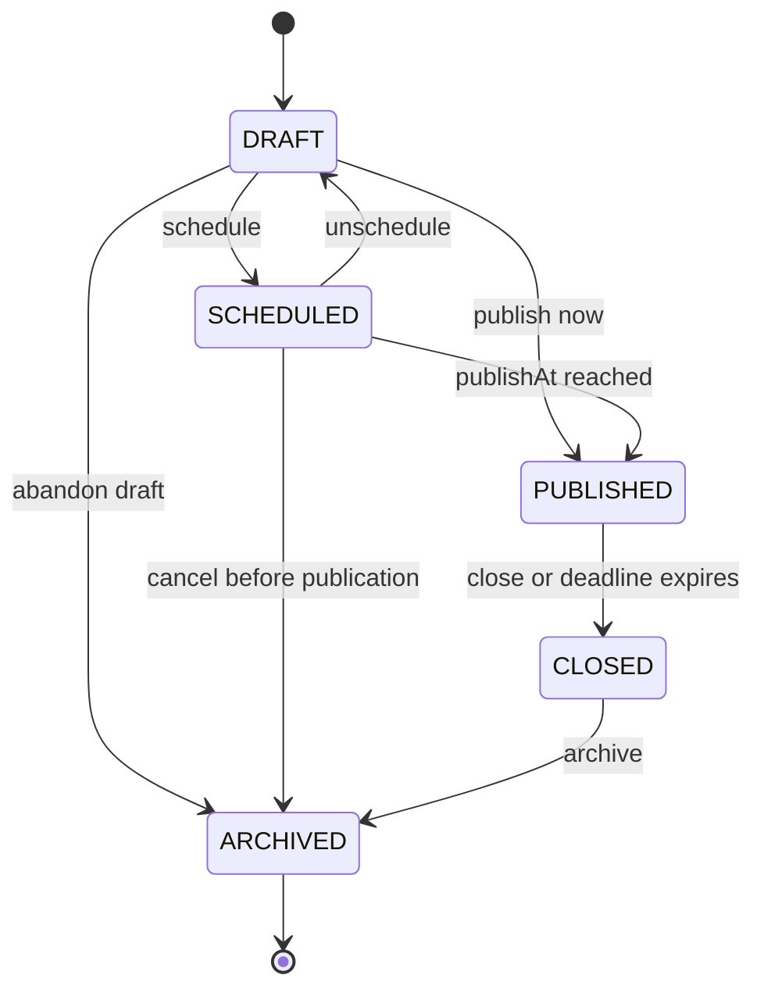
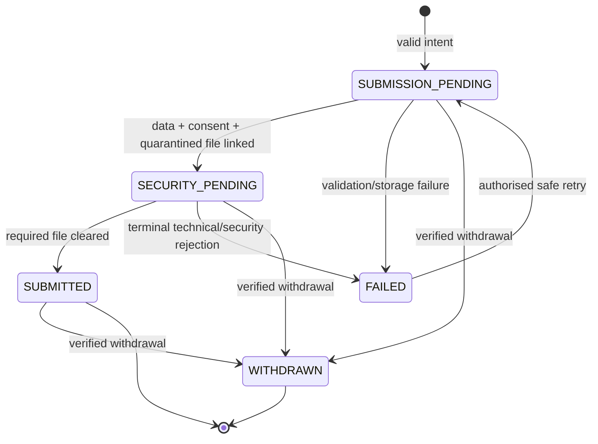
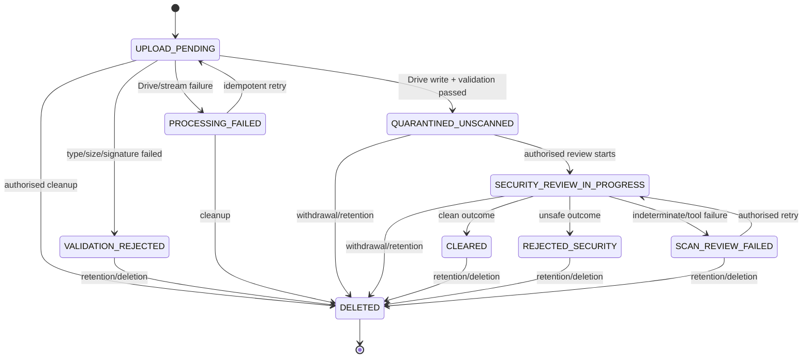
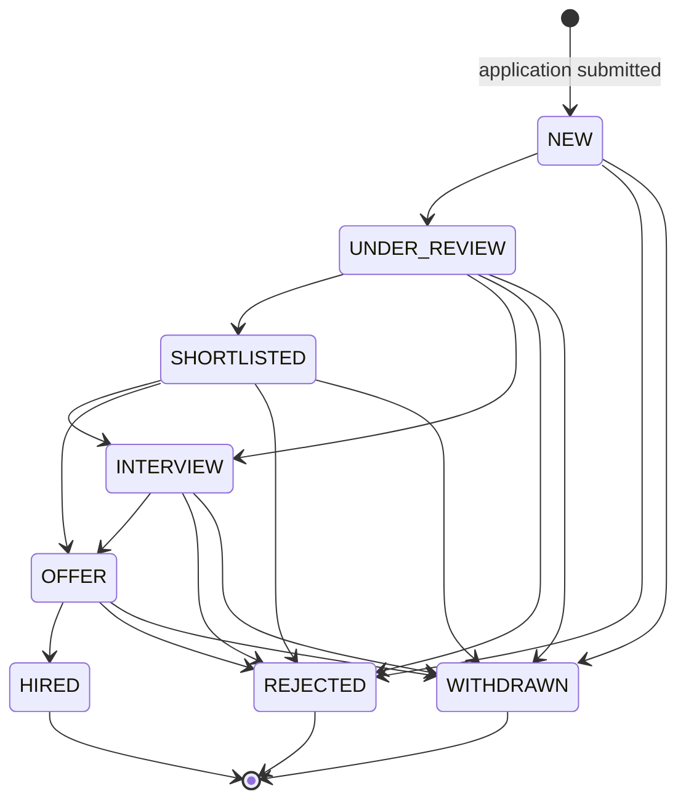
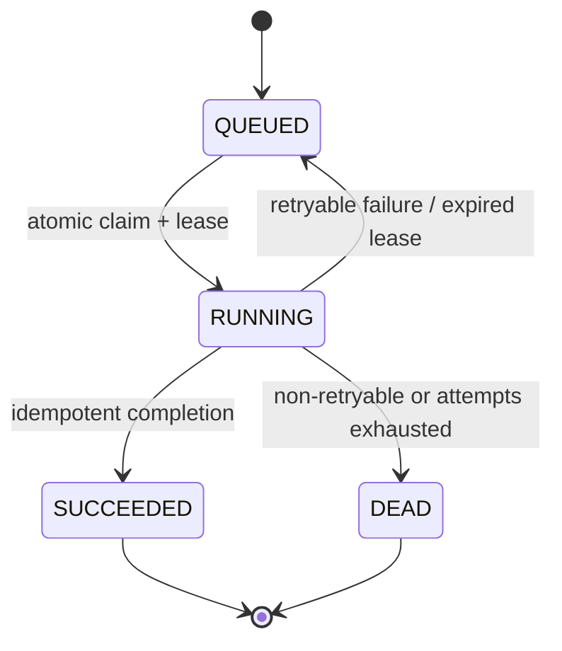

# Phase 0E: State Machines

**Status:** Accepted for Phase 0E documentation; implementation remains gated

**Date:** 2026-08-27

**Scope:** Job, application technical, candidate-file security, hiring, and PostgreSQL background-job lifecycles. All timestamps are UTC and all transitions are enforced server-side and audited where specified.

## Shared rules

- State is changed only through named domain transitions, never arbitrary enum updates.
- The server authorizes actor, operation, target, current state, retention, and optimistic version inside the transition transaction (SEC-001).
- Technical application state, file state, hiring state, publication state, and retention/deletion state are independent.
- Current-state columns are query projections. Immutable `ApplicationStatusEvent`, `FileSecurityReview`, and `AuditEvent` rows preserve history.
- Invalid, stale, duplicate, or out-of-order transitions fail without partially changing state.
- External side effects such as Drive and email are reconciled by idempotent jobs; they do not manufacture a committed business transition.

## Job lifecycle

| Transition | Authorization | Validation/invariants | Public/applications/structured data | Audit |
| --- | --- | --- | --- | --- |
| Create -> `DRAFT` | `job.create`: `HIRING_MANAGER`, `ADMIN` | Immutable ID; slug unique; draft may be incomplete. | Not public, not indexable, no applications, no `JobPosting`. | Creation required. |
| `DRAFT` -> `SCHEDULED` | `job.publish` | All publish-required fields/questions valid; `publishAt` is future; deadline is after publish time; approved HR content only. | Hidden until effective publish time; no applications or structured data early. | Actor, schedule time, outcome. |
| `DRAFT` -> `PUBLISHED` | `job.publish` | All publish-required fields valid; deadline is future or null; slug stable. | Public/indexable; applications accepted only while effective-open predicate passes; valid `JobPosting` permitted. | Required. |
| `SCHEDULED` -> `DRAFT` | `job.edit` | No publication has occurred. | Remains private; schedule cleared. | Required. |
| `SCHEDULED` -> `PUBLISHED` | `SYSTEM` under recorded schedule; manager/admin may invoke controlled retry | Current time >= `publishAt`; content still valid; deadline still future; optimistic version matches. | Becomes public/open and may emit `JobPosting`. | System event and outcome required. |
| `DRAFT`/`SCHEDULED` -> `ARCHIVED` | `job.archive` | No accepted application may be lost; scheduled work cancelled idempotently. | Never public; no application intake/structured data. | Required. |
| `PUBLISHED` -> `CLOSED` | `job.close` or `SYSTEM` deadline closure | `closedAt` set once; transition idempotent. | No new applications; direct URL shows truthful closed state; `JobPosting` removed immediately. | Required, including system expiry. |
| `CLOSED` -> `ARCHIVED` | `job.archive` | Historical applications remain; slug/ID retained. | May remain a truthful non-indexed/archive page according to later content policy; never accepts applications or emits `JobPosting`. | Required. |

Effective application acceptance is checked on every submission, not inferred from cron:

`lifecycleState = PUBLISHED AND publishAt <= now AND (applicationDeadline IS NULL OR now < applicationDeadline) AND closedAt IS NULL`.

Therefore an expired job stops accepting applications and stops emitting `JobPosting` even if the closure job is delayed (FR-006, SEO-003). Reopening a closed job and changing a published slug are not MVP transitions; create a new vacancy unless a later approved requirement defines controlled reopening/redirect behaviour.

## Application technical lifecycle

No durable candidate draft is stored. A short-lived idempotent submission intent precedes or creates `SUBMISSION_PENDING`; it is not a candidate account or resumable profile (FR-019).

| Transition | Authorization/actor | Invariants |
| --- | --- | --- |
| Start -> `SUBMISSION_PENDING` | Anonymous public server flow after Turnstile/rate/idempotency checks | Job/talent context valid; scoped idempotency key reserved; no receipt yet. |
| `SUBMISSION_PENDING` -> `SECURITY_PENDING` | System in submission transaction/workflow | Required structured fields and consent versions stored; one candidate file durably linked in private quarantine; validation state known; no public/Drive URL. |
| Pending -> `FAILED` | System | Safe failure/reason code recorded; no ambiguous receipt; any external Drive object queued for reconciliation. |
| `SECURITY_PENDING` -> `SUBMITTED` | System after file-clear transaction | Required consent accepted; file validation passed; security status `CLEARED`; cleared hash/version matches; retention policy and expiry applied; unique public reference committed. Current hiring status becomes `NEW`. |
| `SECURITY_PENDING` -> `FAILED` | System | File validation failed, security rejected, or approved retry path exhausted. Uncleared file remains inaccessible and retention-bound. |
| `FAILED` -> `SUBMISSION_PENDING` | Anonymous/system through same valid submission intent or support-approved retry | Retry remains within idempotency lifetime; request hash/context still matches; no second accepted application is created. A replacement file is a new `CandidateFile` row. |
| Any non-withdrawn -> `WITHDRAWN` | `HIRING_MANAGER`/`ADMIN` after a verified candidate request; system only for an authenticated future flow | `withdrawnAt` set; hiring state also becomes `WITHDRAWN` if it existed; future access/deletion follows approved policy. |

`SUBMITTED` means technically complete and eligible for authorised hiring review. It does not mean shortlisted, safe for public use, or guaranteed a response. Hiring state is null before submission and separate afterward.

## Candidate file lifecycle

The lifecycle below is a composite view of three stored dimensions:

- validation: `PENDING`, `PASSED`, `FAILED`;
- technical: `UPLOAD_PENDING`, `QUARANTINED`, `PROCESSING_FAILED`, `DELETED`;
- security: `UNREVIEWED`, `IN_REVIEW`, `CLEARED`, `REJECTED`, `REVIEW_FAILED`.

This avoids separate `CLEARED_MANUAL` and `CLEARED_AUTOMATED` states. A cleared file stores `securityStatus = CLEARED` plus `clearanceMethod = MANUAL | AUTOMATED`; immutable `FileSecurityReview` rows contain attempts and outcomes.

Composite mapping:

| Display concept | Stored state |
| --- | --- |
| `UPLOAD_PENDING` | technical `UPLOAD_PENDING`, validation `PENDING`, security `UNREVIEWED` |
| `QUARANTINED_UNSCANNED` | technical `QUARANTINED`, validation `PASSED`, security `UNREVIEWED` |
| `VALIDATION_REJECTED` | technical `QUARANTINED` or `PROCESSING_FAILED`, validation `FAILED`, security never `CLEARED` |
| `SECURITY_REVIEW_IN_PROGRESS` | technical `QUARANTINED`, validation `PASSED`, security `IN_REVIEW` |
| `CLEARED` | technical `QUARANTINED`, validation `PASSED`, security `CLEARED`, method and `clearedAt` present |
| `REJECTED_SECURITY` | technical `QUARANTINED`, validation `PASSED`, security `REJECTED` |
| `SCAN_REVIEW_FAILED` | technical `QUARANTINED`, validation `PASSED`, security `REVIEW_FAILED` |
| `PROCESSING_FAILED` | technical `PROCESSING_FAILED`; never reviewable |
| `DELETED` | technical `DELETED`, provider ID removed, `deletedAt` present; irreversible in the application domain |

### File invariants

1. Every stored file remains private; no public Drive link, candidate link, or general staff Drive membership exists (SEC-002, SEC-006).
2. One PDF up to the configured initial 5 MiB limit is accepted. Extension, declared/detected MIME, size, and `%PDF-` signature must pass; these checks are not malware scanning.
3. Validation failure can never transition to clearance. A corrected submission creates a new file row.
4. `CLEARED` requires an immutable completed review with matching SHA-256, an allowed outcome, and method. Current projection, review row, and audit event commit together.
5. `HIRING_REVIEWER` cannot retrieve any uncleared file. Only `HIRING_MANAGER`/`ADMIN` with `candidate_file.security_review` may retrieve quarantine for the approved manual procedure.
6. Quarantine review delivery is attachment-only through the application server after fresh authorization; no inline preview or Drive ID/URL is exposed.
7. A future automated scanner uses `method = AUTOMATED` and the same review/outcome transition. No file or application schema redesign is required.
8. Deletion is irreversible in the application domain. A restored provider copy remains quarantined and inaccessible until authorised reconciliation and policy replay.
9. Concurrent review results use file version/hash and idempotency keys; stale outcomes are rejected.
10. Folder/zone location is operational organisation, not security authority. PostgreSQL state controls access.

## Manual malware/security workflow

The approved MVP workflow is:

1. Server receives a bounded PDF stream, validates extension/MIME/signature/size, assigns an opaque filename, writes it to private Drive quarantine, and records checksum/state.
2. File remains `QUARANTINED_UNSCANNED`; the application remains `SECURITY_PENDING`. Ordinary hiring reviewers see only safe file-existence/state metadata.
3. A named `HIRING_MANAGER` or `ADMIN` with `candidate_file.security_review` initiates review. Fresh authorization, file version/hash, and audit are checked.
4. The reviewer retrieves an attachment through the server to the approved managed security-review endpoint/tool. No inline preview or Drive link is used.
5. The reviewer submits a scoped idempotent result with method/tool/version, observed hash, outcome, and safe code.
6. `CLEARED` makes the application eligible for `SUBMITTED`; `REJECTED` makes it technically failed; `INDETERMINATE`/tool failure becomes `REVIEW_FAILED` and remains quarantined for retry/escalation.

The exact managed endpoint/tool, named operator, operating instructions, evidence, escalation timing, and residual-risk acceptance remain pre-intake decisions. Until they are documented and verified, the model exists but production candidate-file intake stays disabled.

## Hiring lifecycle

Hiring state is a small auditable workflow, not a full ATS.

| Rule | Requirement |
| --- | --- |
| Entry | Only a technically `SUBMITTED` application enters `NEW`. |
| Actor | `HIRING_REVIEWER`, `HIRING_MANAGER`, or `ADMIN` may make ordinary hiring transitions; verified withdrawal recording is manager/admin only. |
| Evidence | Every change inserts `ApplicationStatusEvent` with from/to, actor, timestamp, and safe reason code in the same transaction as current status. |
| Candidate visibility | No candidate account/status portal or automatic disclosure exists in MVP (FR-019). Email behaviour is a separate approved communication action. |
| Notes | Internal notes are separate append-only records and are not file-security reviews or audit events. |
| Terminal states | `HIRED`, `REJECTED`, and `WITHDRAWN` are terminal in ordinary operation. A mistaken transition requires a manager/admin correction operation that appends a new event and audit record; history is never overwritten. |
| Retention | Hiring status does not suspend expiry or deletion. Only an approved future legal-hold model could do so. |

## Background job lifecycle

| Transition | Invariants |
| --- | --- |
| Create -> `QUEUED` | Job type allowed; payload contains no candidate PII/secrets; explicit subject FK where applicable; optional dedupe key unique; `availableAt` set. |
| `QUEUED` -> `RUNNING` | Claimed in a bounded transaction using row locks/atomic lease; state/availability rechecked; attempt increments; random claim token and expiry written. |
| `RUNNING` -> `SUCCEEDED` | Matching unexpired claim token; business state confirms effect; `completedAt` recorded. Duplicate handler execution returns same effective result. |
| `RUNNING` -> `QUEUED` | Retryable safe failure or expired lease; bounded backoff; claim cleared; attempts remain below maximum. |
| `RUNNING` -> `DEAD` | Non-retryable classification or maximum attempts reached; scrubbed error summary only; operational alert/audit as required. |

One Hostinger UTC cron invokes a protected worker route and claims a small batch. Multiple or overlapping invocations remain safe because PostgreSQL claims, leases, unique dedupe/idempotency records, and business-state checks are authoritative. A job payload never contains names, contact details, answers, filenames, file contents, Drive URLs/IDs where an explicit file FK suffices, email bodies, tokens, or secrets (OPS-004, SEC-006).

Initial job types are receipt email, candidate retention/deletion, abandoned submission cleanup, and Drive reconciliation. Managed queues are deferred until measured overlap, backlog, latency, or Hostinger request/resource limits justify them.

## Cross-machine invariants

1. A job can accept an application only while effectively published and before its deadline.
2. An application cannot become `SUBMITTED` without required consent and a matching cleared file.
3. Hiring state cannot start or change before technical submission, and never changes file security state.
4. File validation is not malware clearance; only an immutable review can clear a file.
5. Uncleared, validation-failed, processing-failed, rejected, expired, deletion-pending, and deleted files are inaccessible to ordinary hiring review.
6. Candidate-file deletion blocks access before external Drive deletion and remains blocked through retries/restores.
7. Every mutation uses optimistic/current-state checks; stale concurrent transitions fail.
8. Idempotent retries return or converge on one business result rather than creating duplicate applications, reviews, emails, or deletions.
9. Disabled staff and missing role context deny every private transition.
10. Audit/job/error payloads contain opaque IDs and safe codes only, never candidate PII, document data, secrets, or provider URLs.
