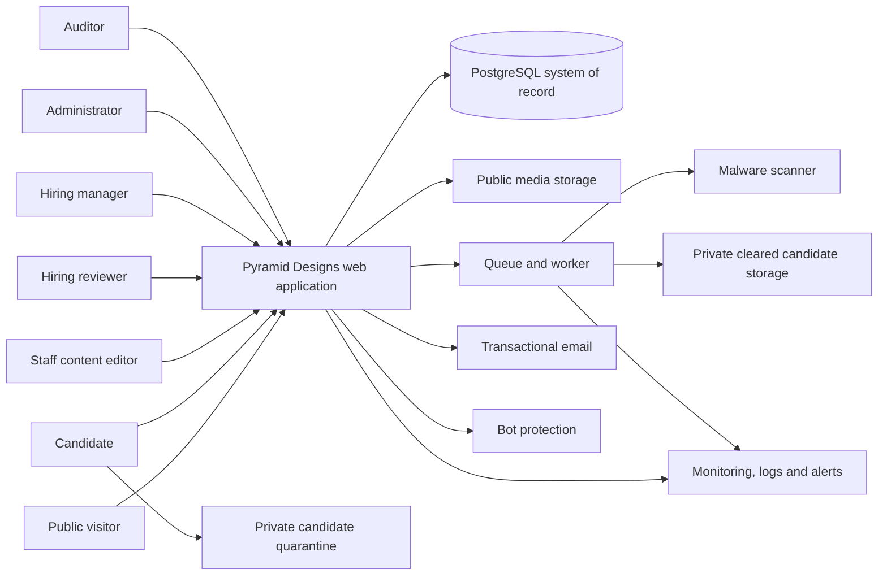
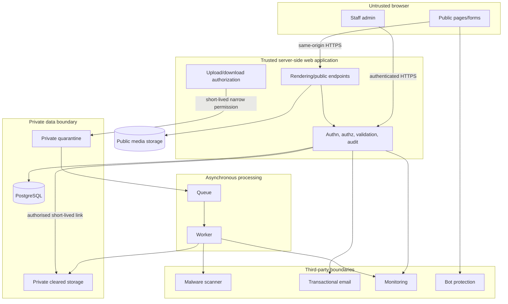

# Pyramid Designs System Architecture

**Status:** Proposed — Phase 0C, 2026-08-27
**Scope:** Provider-neutral production architecture. No application, account, cloud resource, provider selection, secret, or production configuration is created by this record.

## 1. Executive summary

Use a server-first modular monolith: one web application owns public publishing, staff administration, authenticated server operations and policy enforcement. PostgreSQL is the structured system of record. Public portfolio media is separate from private candidate-document storage. A queue/worker performs malware scanning, email, media processing, retention and deletion outside request/response paths.

Candidate documents begin in private quarantine. They never become staff-downloadable or reviewable until independent validation and a successful scan are durably recorded. This supports managed cloud capabilities without creating microservices, Kubernetes, service mesh or event streaming.

## 2. Principles

- Server-render indexable content; browser code is limited to interaction leaves (PERF-002, ACC-004).
- Default deny: every sensitive server read, mutation and signed download checks actor, role, target and state (SEC-001).
- Treat browsers, uploads, staff sessions, third parties and preview as separate trust boundaries.
- Keep candidate data out of public storage and fail closed for candidate security controls (SEC-002, SEC-006).
- Keep legal jurisdiction, consent, retention, roles, file limits and allowlists policy/configuration inputs, never hard-coded business assumptions.
- Use synthetic data outside production (OPS-001).

## 3. Phase 0B blocker reclassification

No Phase 0B group is a hard blocker to this provider-neutral architecture. The final values remain gates for later work.

| Item | Classification | Safe architecture position | Latest safe resolution |
| --- | --- | --- | --- |
| Legal entity, operating locations, residency/cross-border duties (DEC-001) | **ARCHITECTURE PARAMETER** | Candidate data is isolated; region/processor inventory and notices are selectable. | Before Phase 0D provider selection and production collection. |
| Retention, deletion, consent, reviewer ownership (DEC-002) | **ARCHITECTURE PARAMETER** | Consent/policy are versioned; retention workflow and role grants are configurable. | Before candidate-data implementation is final; approved policy before production. |
| File types/sizes (DEC-003) | **FEATURE-GATE DECISION** | Do not enable public uploads before an approved allowlist and limits. | Before CV/document upload. |
| Scan-failure ownership (DEC-003) | **PRODUCTION-GATE DECISION** | Failed/timed-out scans stay quarantined; retry/escalation is policy-driven. | Before production intake. |
| Staff identity/MFA policy (DEC-003) | **PRODUCTION-GATE DECISION** | Staff-only accounts, revocation and step-up capability are mandatory. | Before staff production access. |

Every **PROVISIONAL** item below must be approved at its stated gate; it is not permission to collect candidate data.

## 4. System context

## 5. Runtime/container architecture

The browser can write only one pre-authorised quarantine key; it cannot list/read a cleared key. Preview has no production database, candidate storage, queue, email delivery, credential or unrestricted staff-identity access.

## 6. Trust-boundary contract

| Boundary | Data and controls | Failure behaviour |
| --- | --- | --- |
| Browser → app | TLS; validate every field, idempotency key, origin and abuse signal. Staff mutations require session, CSRF/origin protection and policy. | Reject safely with generic public response. |
| Browser → quarantine | Short-lived, single-object permission after intent validation; random key, private encryption, size/type conditions where available. | Expiry/partial/invalid upload is never reviewable. |
| App → PostgreSQL | Encrypted/private transport, least-privilege credential, parameterized data access, transactions for state/audit changes. | Fail closed for candidate/admin work; public reads degrade safely. |
| Storage → worker/scanner | Authenticated job with opaque object ID and version/checksum; worker revalidates extension, MIME, magic bytes and size. | No result/mismatch/timeout remains quarantined; alert and retry. |
| App → email | Receipt/reference and safe operational text only; never a CV, attachment or signed URL. | Durable submission state remains authoritative; queue/retry mail. |
| App/worker → monitoring | Only opaque IDs and safe request context. | Alert on unavailable monitoring; do not leak data to fallback sinks. |
| Preview → production | Separate secrets/databases/storage; email sink; synthetic data only. | Block by provider/access policy, not convention. |

## 7. Data classification

| Class | Examples | Storage/access | Telemetry, retention and backup |
| --- | --- | --- | --- |
| PUBLIC | Published projects, jobs, culture/media | Public records/media; visitor read. | Standard telemetry; normal business retention/backups. |
| INTERNAL | Non-sensitive publish/operational metadata | Database; appropriate staff role. | No candidate identifiers; operational retention/backups. |
| CONFIDENTIAL | Candidate contact data, answers, internal notes/status | Database; authorised hiring roles. | Never analytics/URLs/error payloads; retention **PROVISIONAL**; encrypted restricted backups. |
| RESTRICTED | CV objects, auth secrets, sessions, privileged credentials | Private candidate storage/secret manager; clean document only to authorised hiring staff. | Never logs/analytics/email; policy retention; encrypted tightly controlled backups. |

Never put CV contents, identifying filenames, names, emails, phone numbers, free-text answers, signed URLs, secrets or session tokens in logs, errors, analytics, monitoring tags, URL paths or query strings. Use opaque application/upload/audit IDs.

## 8. Candidate submission flow

1. The candidate opens a job or evergreen form; server provides validated submission context. There is no candidate account (FR-019).
2. Server validates structured data, consent version, anti-abuse controls and idempotency, then authorises upload intent.
3. Browser uploads directly to a random private **quarantine** key using a narrow, short-lived permission.
4. A durable job binds the object version/checksum. Worker validates extension allowlist, MIME, magic signature and configured size again, then scans.
5. Clean result moves/copies to restricted cleared storage atomically with the clean state. Suspicious, infected, failed, mismatched or timed-out files stay unavailable.
6. Only accepted structured applications with all required clean documents become eligible for review. Receipt has opaque reference only.
7. Staff document request performs a fresh policy check and creates short-lived download access; the outcome is audited.
8. Policy-versioned retention/deletion removes records and objects; correction/deletion requests have an owner.

**PROVISIONAL:** types, limits, duplicate window, retention periods, scan retry count and escalation owner. Resolve before upload/production gates; final limits must be enforced at application, storage and proxy/edge layers.

## 9. State separation

Technical states are independent of HR hiring labels.

| Submission state | Meaning |
| --- | --- |
| DRAFT/STARTED | Optional, untrusted, not an account. |
| VALIDATING | Structured data/upload intent validation. |
| UPLOAD_PENDING | Limited upload permission exists; no trusted file. |
| SCANNING | Private quarantine only. |
| SECURITY_REJECTED | Validation/scan failure; never clean. |
| TECHNICAL_FAILURE | Safe retry/support state; no reviewer access. |
| ELIGIBLE_FOR_REVIEW | Accepted data and every required file clean. |
| EXPIRED/DELETED | Policy blocks access. |

| File state | Meaning |
| --- | --- |
| INTENDED | Authorised key only. |
| QUARANTINED / SCANNING | Private; no staff/public access. |
| CLEAN | Validated and available only by authorised request. |
| REJECTED / INFECTED / FAILED | Unavailable, retained/retried/deleted only by policy. |
| DELETED | No link may be issued. |

A hiring status can attach only after `ELIGIBLE_FOR_REVIEW`; it never changes file state. Expired signed links grant no continuing access.

## 10. Authentication and authorization

Staff accounts only. Selected identity capability must provide MFA, secure HTTP-only sessions, expiry/rotation, revocation, account disablement and separate preview/production identities. Passwordless, password and federated methods are provider decisions. Reauthenticate role changes, retention-policy changes, staff disablement and destructive candidate deletion where supported.

| Permission | CONTENT_EDITOR | HIRING_REVIEWER | HIRING_MANAGER | ADMIN | AUDITOR |
| --- | --- | --- | --- | --- | --- |
| Edit/publish projects/culture | Yes | No | No | Yes | No |
| Create/publish jobs | No | No | Yes | Yes | No |
| View application metadata/personal data | No | Yes | Yes | Yes | Read audit scope only |
| Request/download clean file | No | Yes | Yes | Yes | No |
| Change hiring status/write notes | No | Yes | Yes | Yes | No |
| Delete candidate/configure retention | No | No | No | Yes | No |
| Access audit history | No | No | Limited own actions | Yes | Yes |
| Manage staff users/roles | No | No | No | Yes | No |

Server policy evaluates identity, role, target and state for every sensitive read/mutation/link; UI hiding is never authorization. **PROVISIONAL:** reviewer metadata-only/download approval constraints; resolve before staff-admin implementation.

## 11. Document access, environment and operations

Use random non-semantic storage keys, a safe displayed filename, no permanent URL/public route/active inline preview/email attachment. On every request the server checks staff session, role, scope, clean state and retention state, audits outcome, then issues a very short-lived attachment-style download response or signed storage URL. Prefer a signed URL only if the chosen provider offers narrow expiry, disposition and auditable correlation; otherwise stream server-mediated. This is **PROVISIONAL** until Phase 0D capability evidence.

Development and preview use synthetic data, distinct secrets/databases/storage/queues and email sinks. Production candidate data is allowed only after policy, provider, ownership and controls approval.

Retention/deletion is a policy-versioned asynchronous workflow: select eligible records, remove objects/data as permitted, write minimal audit metadata, retry safely and alert on failure. **PROVISIONAL:** durations, legal holds and request verification. PostgreSQL needs encrypted backups/PITR; private storage needs durable recovery where policy permits. Deleted data may remain in historical backups until expiry. Restore must replay deletion/retention state before exposure and is audited.

Audit history is append-only/tamper-evident through application/database restrictions. It records actor, action, opaque target type/ID, timestamp, safe request context, policy/version and outcome. It covers candidate/file view/download, hiring status/note, deletion, retention changes, job publication and role/account changes; never candidate content.

## 12. Abuse, CSRF, headers and failure handling

Layer privacy-conscious bot challenge, honeypot, timing heuristic, scoped per-IP and per-submission-identity limits, upload-intent limits, duplicate detection and idempotency. Controls decay and use generic responses; shared/mobile IPs are not permanently blocked.

Cookie-backed staff mutations require SameSite cookies plus Origin/Referer validation and CSRF tokens. Public forms require origin and idempotency checks; use CSRF tokens only if a cookie-backed anonymous session exists. Bearer-token endpoints do not rely on cookie CSRF controls.

Use strict nonce/hash CSP with minimal allowlist, `frame-ancestors 'none'` unless an approved integration changes it, HSTS after HTTPS, `X-Content-Type-Options: nosniff`, restrictive `Referrer-Policy` and deny-by-default `Permissions-Policy`. Add 3D, analytics, bot, storage or email origins only after selection—never pre-weaken CSP.

| Failure | Required response |
| --- | --- |
| Database unavailable | Fail closed for forms/admin; no ambiguous success; public safe unavailable/read-only response. |
| Storage unavailable/expired upload | Do not accept file; allow fresh authorised retry. |
| Scanner unavailable/timeout | Quarantine, retry/alert; never reviewable. |
| Queue unavailable | Do not claim completion; persist safely or reject/retry. |
| Email unavailable | Queue/retry receipt; data state is authoritative. |
| Monitoring unavailable | Independent health alert; never leak fallback diagnostics. |
| Duplicate/partial/abandoned | Idempotency/reference prevents duplicate review; expire intent. |
| Expired download | Require fresh authorization; do not renew automatically. |

## 13. 3D boundary, open decisions and Phase 0D inputs

3D is an isolated optional enhancement: static/semantic server-rendered content, navigation and forms arrive first; dynamic canvas respects reduced motion/save-data, pauses hidden/offscreen and falls back to poster/semantic content. It has no candidate-data/auth/admin dependency (3D-001–3D-005).

Phase 0D needs legal entity/jurisdictions; residency/processor constraints; retention/deletion/consent policy; reviewer/MFA/reauth policy; file allowlist/size/scan SLA/failure owner; Pakistan latency/budget/account ownership; backup RPO/RTO; alert/on-call owner; email domain controls; preview isolation; and evidence for private storage, quarantine upload, scanner, signed-download/audit, queue, rate limit/idempotency, monitoring and CSP-compatible bot protection.

## 14. Verification

- No application code, package manifest/install, provider, cloud resource, secret or production configuration was created.
- The architecture is one modular monolith plus managed capabilities; no unnecessary independent services were introduced.
- Candidate security paths fail closed; public presentation degrades gracefully.
